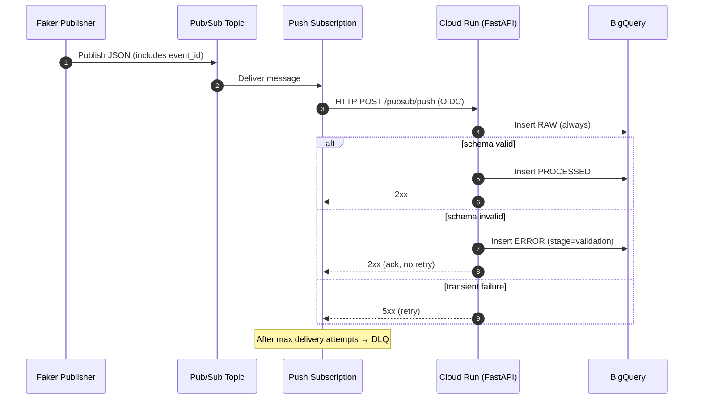

# Real-time Ecommerce Streaming Pipeline (GCP)

## Architecture (Mermaid)

```mermaid
flowchart LR
  A[Publisher\n`publisher/` (Python + Faker)] -->|JSON events| B[Pub/Sub Topic\n`ecommerce_events`]
  B --> C[Push Subscription\nOIDC auth + retry + DLQ]
  C -->|POST /pubsub/push| D[Cloud Run\nFastAPI Processor]

  D --> E[(BigQuery RAW\n`ecommerce_raw_events`)]
  D --> F[(BigQuery PROCESSED\n`ecommerce_processed_events`)]
  D --> G[(BigQuery ERROR\n`ecommerce_error_events`)]

  C -. after max attempts .-> H[DLQ Topic\n`ecommerce_events_dlq`]
  H --> I[DLQ Subscription\n`ecommerce_events_dlq_sub`]
```

## Data flow (high level)



## Tables

- RAW: stores original JSON + Pub/Sub metadata + validation outcome
- PROCESSED: clean typed schema for analytics
- ERROR: operational table for validation failures and processed insert failures
